# FinTwin Architecture Documentation

## Table of Contents

1. [System Overview](#system-overview)
2. [Architecture Principles](#architecture-principles)
3. [Component Architecture](#component-architecture)
4. [Data Architecture](#data-architecture)
5. [AI/ML Architecture](#aiml-architecture)
6. [Security Architecture](#security-architecture)
7. [Deployment Architecture](#deployment-architecture)
8. [Monitoring & Observability](#monitoring--observability)
9. [Scalability Considerations](#scalability-considerations)
10. [Technology Decisions](#technology-decisions)

## System Overview

FinTwin is a comprehensive AI Financial Twin + CA Ecosystem platform built with a microservices architecture, designed to handle India's complex financial landscape while maintaining the highest standards of security, privacy, and compliance.

### High-Level Architecture

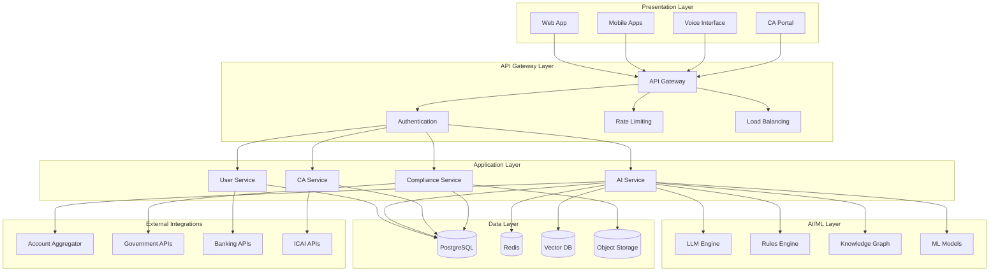

## Architecture Principles

### 1. Privacy-by-Design
- **Data Minimization**: Collect only necessary data
- **Consent Management**: Granular consent with easy revocation
- **Data Residency**: All sensitive data stored within India
- **Encryption**: End-to-end encryption for all data

### 2. India-First Approach
- **Regulatory Compliance**: DPDP Act, RBI, SEBI, GST compliance
- **Localization**: Hindi and regional language support
- **Government Integration**: Direct APIs with ITD, GSTN
- **CA Ecosystem**: Deep integration with ICAI

### 3. Scalability & Performance
- **Microservices**: Independent, scalable services
- **Horizontal Scaling**: Auto-scaling based on demand
- **Caching**: Multi-level caching strategy
- **CDN**: Global content delivery

### 4. Security & Compliance
- **Defense-in-Depth**: Multiple security layers
- **Audit Trail**: Immutable logs with hash chaining
- **Access Control**: Role-based access control
- **Threat Monitoring**: Real-time security monitoring

## Component Architecture

### Frontend Architecture

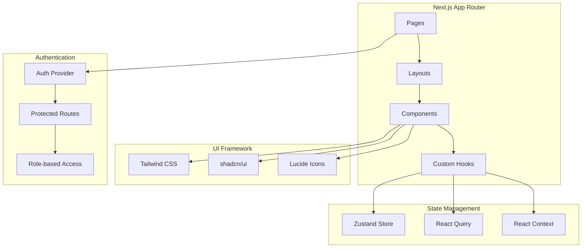

### Backend Architecture

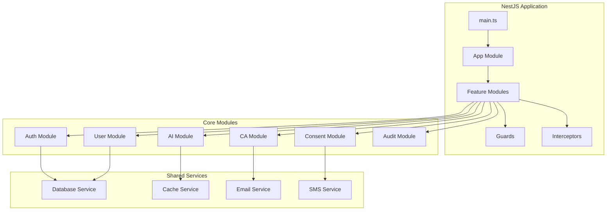

## Data Architecture

### Database Design

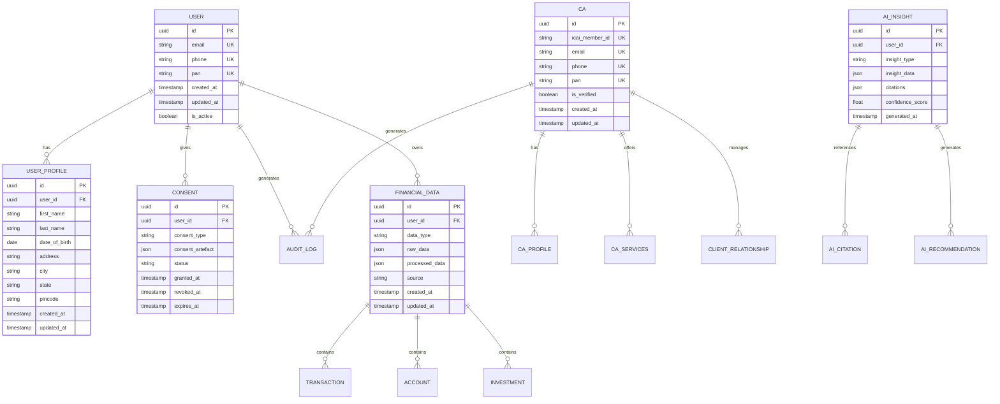

### Data Flow Architecture

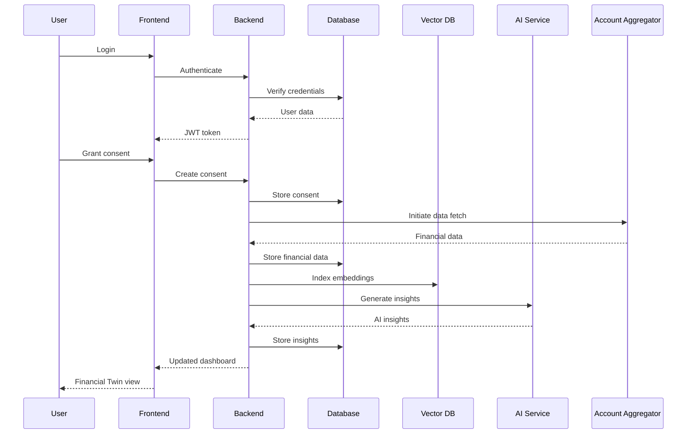

## AI/ML Architecture

### RAG Pipeline Architecture

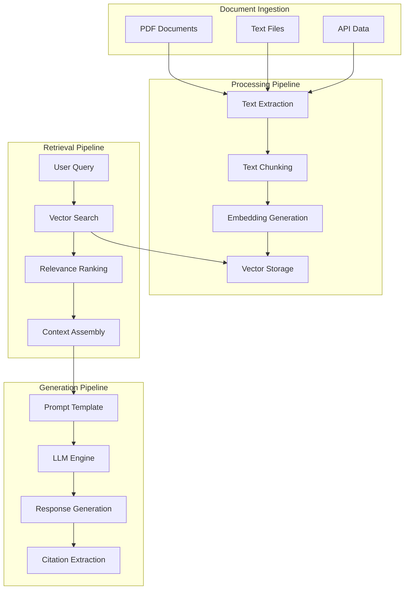

### ML Model Architecture

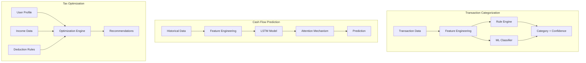

## Security Architecture

### Security Layers

```mermaid
graph TB
    subgraph "Network Security"
        WAF[Web Application Firewall]
        DDoS[DDoS Protection]
        VPN[VPN Gateway]
        FW[Firewall Rules]
    end
    
    subgraph "Application Security"
        AUTH[Authentication]
        AUTHZ[Authorization]
        VALIDATION[Input Validation]
        SANITIZATION[Output Sanitization]
    end
    
    subgraph "Data Security"
        ENCRYPTION[Encryption at Rest]
        TRANSPORT[TLS Encryption]
        KEY_MGMT[Key Management]
        MASKING[Data Masking]
    end
    
    subgraph "Infrastructure Security"
        CONTAINER[Container Security]
        SECRETS[Secrets Management]
        MONITORING[Security Monitoring]
        BACKUP[Secure Backup]
    end
    
    WAF --> DDoS
    DDoS --> VPN
    VPN --> FW
    
    AUTH --> AUTHZ
    AUTHZ --> VALIDATION
    VALIDATION --> SANITIZATION
    
    ENCRYPTION --> TRANSPORT
    TRANSPORT --> KEY_MGMT
    KEY_MGMT --> MASKING
    
    CONTAINER --> SECRETS
    SECRETS --> MONITORING
    MONITORING --> BACKUP
```

### Audit Trail Architecture

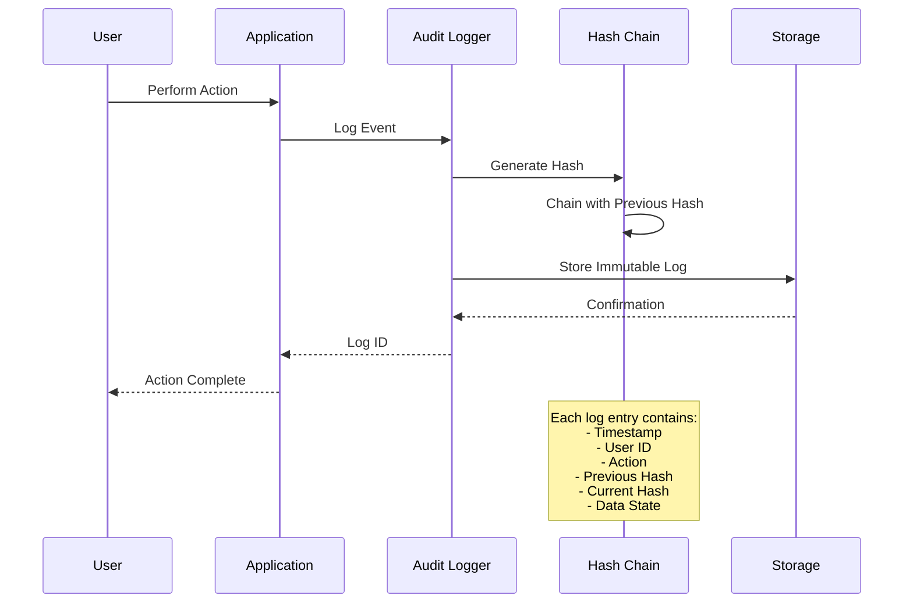

## Deployment Architecture

### Kubernetes Architecture

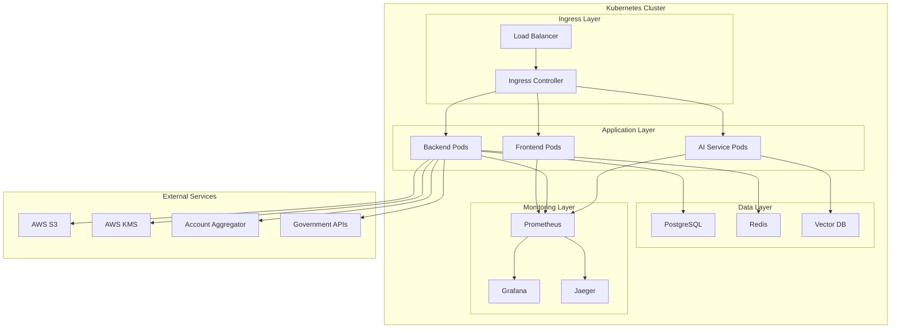

### CI/CD Pipeline

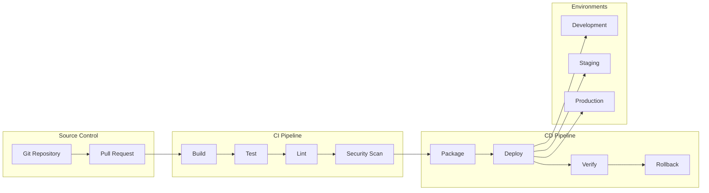

## Monitoring & Observability

### Monitoring Stack

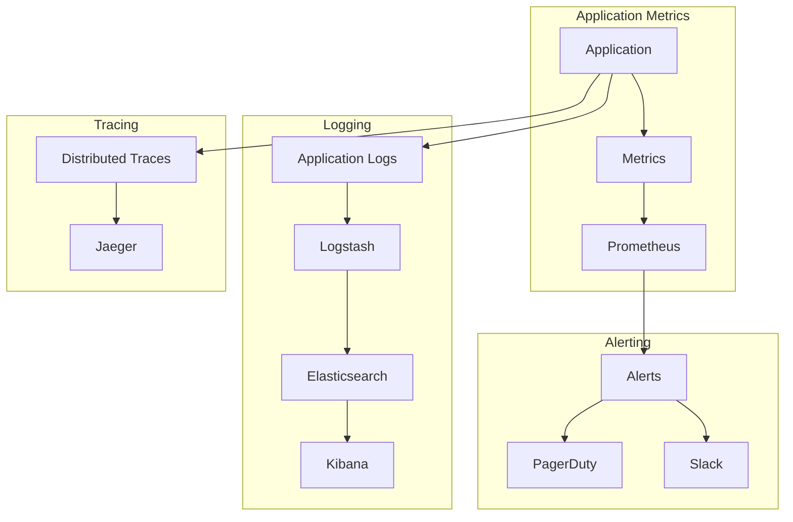

### Key Metrics

#### Application Metrics
- **Response Time**: P50, P95, P99 latencies
- **Error Rate**: 4xx and 5xx error percentages
- **Throughput**: Requests per second
- **Availability**: Uptime percentage

#### Business Metrics
- **User Engagement**: Daily/Monthly active users
- **Conversion Rate**: Free to paid conversion
- **Revenue**: Monthly recurring revenue
- **Customer Satisfaction**: NPS scores

#### Infrastructure Metrics
- **CPU Usage**: Average and peak CPU utilization
- **Memory Usage**: Memory consumption patterns
- **Disk I/O**: Read/write operations
- **Network I/O**: Bandwidth utilization

## Scalability Considerations

### Horizontal Scaling Strategy

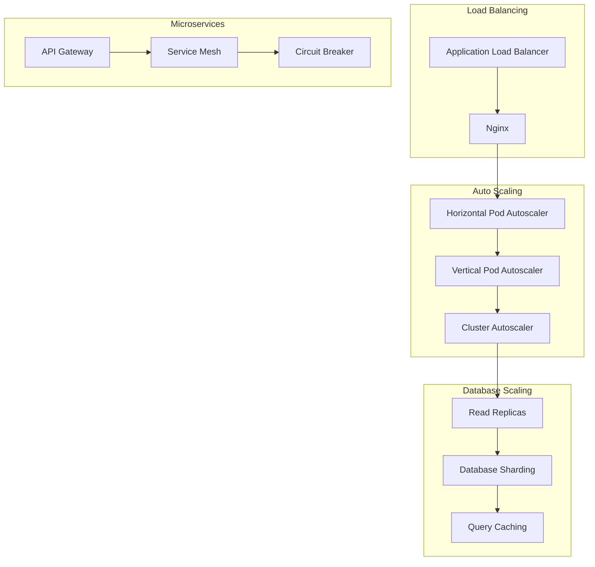

### Performance Optimization

#### Caching Strategy
- **L1 Cache**: Application-level caching (Redis)
- **L2 Cache**: Database query caching
- **L3 Cache**: CDN caching for static assets
- **L4 Cache**: Browser caching

#### Database Optimization
- **Indexing**: Strategic index creation
- **Query Optimization**: Query plan analysis
- **Connection Pooling**: Efficient connection management
- **Partitioning**: Table and index partitioning

## Technology Decisions

### Frontend Technology Stack

| Technology | Choice | Rationale |
|------------|--------|-----------|
| Framework | Next.js 14 | App Router, SSR, excellent DX |
| Language | TypeScript | Type safety, better maintainability |
| Styling | Tailwind CSS | Utility-first, consistent design |
| UI Components | shadcn/ui | Accessible, customizable components |
| State Management | Zustand + React Query | Lightweight, server state management |
| Testing | Jest + RTL | Industry standard, comprehensive testing |

### Backend Technology Stack

| Technology | Choice | Rationale |
|------------|--------|-----------|
| Framework | NestJS | Enterprise-grade, TypeScript-first |
| Language | TypeScript | Type safety, shared types with frontend |
| Database | PostgreSQL | ACID compliance, JSON support |
| ORM | Prisma | Type-safe, excellent DX |
| Vector DB | pgvector | Native PostgreSQL extension |
| Caching | Redis | High-performance, versatile |

### AI/ML Technology Stack

| Technology | Choice | Rationale |
|------------|--------|-----------|
| LLM | Llama 2/Mistral | Open source, cost-effective |
| Embeddings | sentence-transformers | Local processing, privacy |
| Vector DB | pgvector | Integrated with main database |
| ML Framework | PyTorch | Industry standard, flexibility |
| RAG | LangChain | Comprehensive RAG framework |

### Infrastructure Technology Stack

| Technology | Choice | Rationale |
|------------|--------|-----------|
| Containerization | Docker | Industry standard, portability |
| Orchestration | Kubernetes | Scalability, ecosystem |
| Cloud Provider | AWS | Mature services, India region |
| CI/CD | GitHub Actions | Integrated with source control |
| Monitoring | Prometheus + Grafana | Open source, comprehensive |

## Compliance & Security

### Regulatory Compliance

#### DPDP Act 2023
- **Consent Management**: Granular consent with easy revocation
- **Data Minimization**: Collect only necessary data
- **Data Portability**: Export user data in standard format
- **Right to Erasure**: Complete data deletion capability
- **Data Protection Officer**: Dedicated DPO role

#### RBI Guidelines
- **Data Localization**: All sensitive data stored in India
- **Audit Trails**: Immutable logs for all transactions
- **Incident Response**: 6-hour incident reporting
- **Security Standards**: ISO 27001 compliance

#### SEBI Regulations
- **Investment Advisory**: Proper licensing and disclosures
- **Client Onboarding**: KYC and risk profiling
- **Record Keeping**: 5-year record retention
- **Conflict of Interest**: Proper disclosure mechanisms

### Security Measures

#### Authentication & Authorization
- **Multi-Factor Authentication**: TOTP + SMS backup
- **Role-Based Access Control**: Granular permissions
- **Session Management**: Secure session handling
- **Device Management**: Device registration and monitoring

#### Data Protection
- **Encryption at Rest**: AES-256 encryption
- **Encryption in Transit**: TLS 1.3
- **Key Management**: AWS KMS integration
- **Data Masking**: PII protection in logs

#### Monitoring & Incident Response
- **Security Monitoring**: Real-time threat detection
- **Incident Response**: Automated response procedures
- **Vulnerability Management**: Regular security assessments
- **Penetration Testing**: Annual third-party testing

---

*This architecture document is living and will be updated as the system evolves. For questions or clarifications, please contact the architecture team.*
